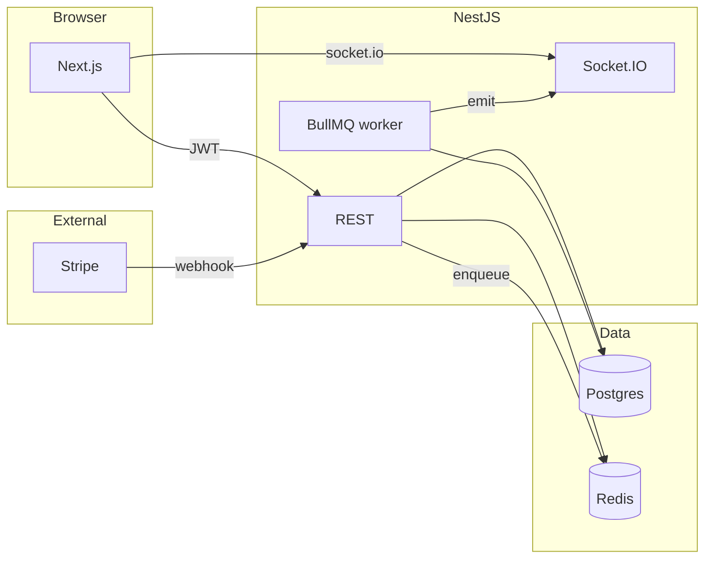

# HypeForge

Real-time **creator support** demo: viewers tip through **Stripe Checkout**, the API trusts **Stripe webhooks**, **BullMQ** fulfills support events (retries, ordering), and **Socket.IO** pushes campaign progress, feed, and leaderboard updates to every open tab.

## Problem

Creators need a Twitch-style loop: **pay → record → aggregate → broadcast** without double-counting tips or trusting the browser “success” page alone.

## Features (MVP)

- **Next.js** marketing + creator page + checkout return + dashboard shell  
- **NestJS** REST API (`/api/...`), Stripe webhook, Socket.IO gateway  
- **PostgreSQL** + **Prisma** for campaigns, products, support events, feed, leaderboard  
- **Redis** + **BullMQ** for async fulfillment after payment  
- **Clerk** auth; API verifies **JWT** bearer tokens  

## Architecture



### AWS-shaped production (README story)

- **API Gateway + Lambda** for HTTP + webhooks  
- **SQS** (+ DLQ) instead of BullMQ for fulfillment  
- **DynamoDB** for high-volume `SupportEvent` / replay log (Postgres remains source of truth for campaigns)  
- **EventBridge** + **Step Functions** for multi-step fulfillment  
- **CloudWatch** alarms on webhook failures and queue age  

## Tech stack

| Layer        | Choice                                      |
| ------------ | ------------------------------------------- |
| Frontend     | Next.js 16, TypeScript, Tailwind, TanStack Query, Clerk, Socket.IO client |
| Backend      | NestJS 11, Prisma, Stripe, BullMQ, Socket.IO |
| Data         | PostgreSQL, Redis                           |
| Auth         | Clerk (JWT to API)                          |
| Monorepo     | npm workspaces + Turborepo                  |

More detail: [docs/LEARNING.md](docs/LEARNING.md).

## Local setup

1. **Node 20+** and **npm**. Optional: **Docker** for Postgres + Redis (`docker compose up -d`).  
2. Copy env: `cp .env.example .env` and fill **Clerk** + **Stripe** test keys.  
3. Install: `npm install` at repo root.  
4. Database: ensure `DATABASE_URL` points at Postgres, then:

   ```bash
   npm run db:migrate -w @hypeforge/api
   npm run db:seed -w @hypeforge/api
   ```

5. **Redis** must be reachable at `REDIS_URL` (worker + queue).  
6. **Stripe webhook** (local): install [Stripe CLI](https://stripe.com/docs/stripe-cli), then:

   ```bash
   stripe listen --forward-to localhost:3001/api/webhooks/stripe
   ```

   Paste the signing secret into `STRIPE_WEBHOOK_SECRET`.

7. Dev servers:

   ```bash
   npm run dev
   ```

   - Web: [http://localhost:3000](http://localhost:3000)  
   - API: [http://localhost:3001/api](http://localhost:3001/api)  

8. Open the demo creator: `/creators/seed_creator_avalive` (or `NEXT_PUBLIC_DEFAULT_CREATOR_ID`).

### Linking the seeded creator to your Clerk user

Seed uses `clerkUserId = seed_clerk_creator`. To see **dashboard** data for a real Clerk account, update the `User` row in Postgres so `clerkUserId` matches your Clerk **user id** (`sub` from the JWT), or change the seed and re-run.

## API flow (viewer)

1. `GET /api/creators/:id` — public profile  
2. `GET /api/creators/:id/campaigns` — campaigns  
3. `GET /api/creators/:id/products` — products (tip)  
4. `GET /api/campaigns/:id/stats|feed|leaderboard` — public  
5. `POST /api/support/checkout` — **Authorization: Bearer** Clerk session token; returns Stripe Checkout URL  
6. Socket: emit `join_campaign` with `{ campaignId }`; listen for `campaign_progress_updated`, `new_support_event`, `leaderboard_updated`  

## Payment flow

1. Client creates checkout with idempotency key → pending `SupportEvent` + Stripe session metadata `supportEventId`.  
2. User pays on Stripe.  
3. `checkout.session.completed` webhook → verify signature → dedupe `StripeWebhookEvent` → mark event **paid** → **enqueue** fulfillment.  
4. Worker (transaction): increment campaign total, mark **fulfilled**, insert feed row, update leaderboard, emit Socket.IO.  

## Realtime flow

- Clients connect to the same origin as `NEXT_PUBLIC_SOCKET_URL` (Nest HTTP + Socket.IO).  
- Join room by emitting `join_campaign` with the active `campaignId`.  

## Scripts

| Command              | Description                |
| -------------------- | -------------------------- |
| `npm run dev`        | Turborepo dev (web + api)  |
| `npm run build`      | Build all workspaces       |
| `npm run db:migrate` | Prisma migrate (api)       |
| `npm run db:seed`    | Seed AvaLive demo data     |

## Screenshots

Add your own after first deploy: creator page, dashboard, Stripe test payment.

## Future improvements

- Pinned messages, perks, multi-campaign, analytics charts  
- Admin moderation + audit UI  
- AWS deployment matching the diagram above  
- Load-test Socket.IO + horizontal scale (Redis adapter)  

## License

MIT (or your choice).
